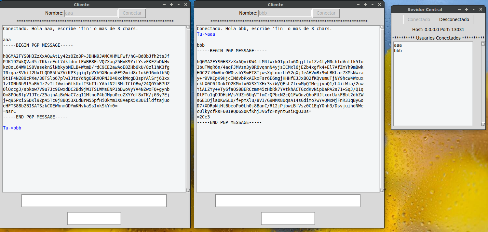

# VerySecureChat v1.30 - GPL v2.0 - IN TEST !
## Very Secure Chat using GPG as encryption system
### Linux Tested - OSX Tested - Windows (on test process)

# Working in the version V 2.0
## Starting it again from Scratch.
Server runs on port 13031 - hostname defined in SERVER Python code
Clients runs and connect to SERVER name, port 13031.

Clientes connect to server, and send PGP message to server, server deliver it to all clientes.

Every client will encript message before send it. Encrypt END-END

Every client will try to de-crypt message, if the message is not PGP, will be show as it.

You need GPG instgalled and Pub/Priv key (you) and PUB keys for others.
You have PRIV/PUB key for your GPG U ID and the Pub KEY for GENERAL UID


***For WINDOWS***
https://gpg4win.org/download.html
SOME ISSUES with PGP / NEW LINE / others

***For OSX***
https://gpgtools.org/

brew install python-tk

***Must create GPG pub/priv key***
```
gpg --full-generate-key
gpg –list-secret-keys
gpg –list-public-keys
```


# How test it 
```
Linux.
-- python3 server.v.1.py
-- python3 client.v.1.py

OSX
-- python3 server.v.1.py
-- python3 client.v.1.py
```


## Donations
```
Bitcoin  3QeNvmaD7bdbaVqidbwZWE27LTDcJWBpYi
Monero   4GdoN7NCTi8a5gZug7PrwZNKjvHFmKeV11L6pNJPgj5QNEHsN6eeX3DaAQFwZ1ufD4LYCZKArktt113W7QjWvQ7CW9WdUe986hCBQ4nivK
LiteCoin LTmsrrWrb5pA77z1zm2fA1hDiuJYrf8gAW

BANK ACCOUNT LT32 3250 0803 5132 5244
BIC REVOLT21
```


