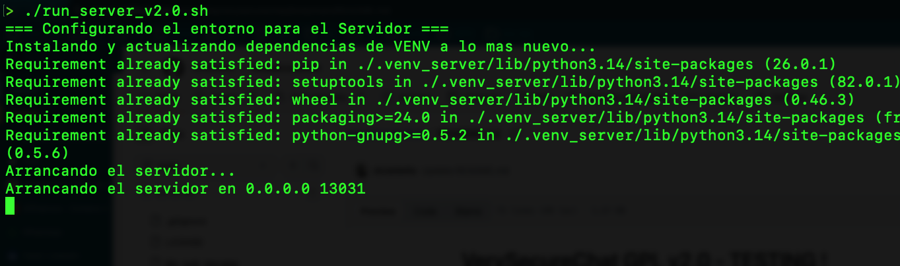
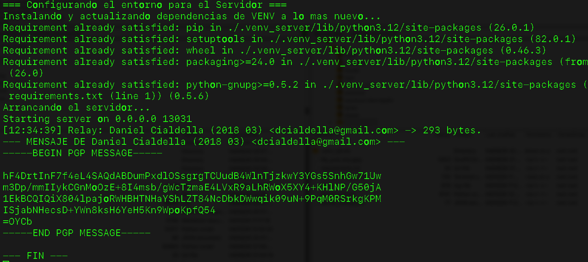
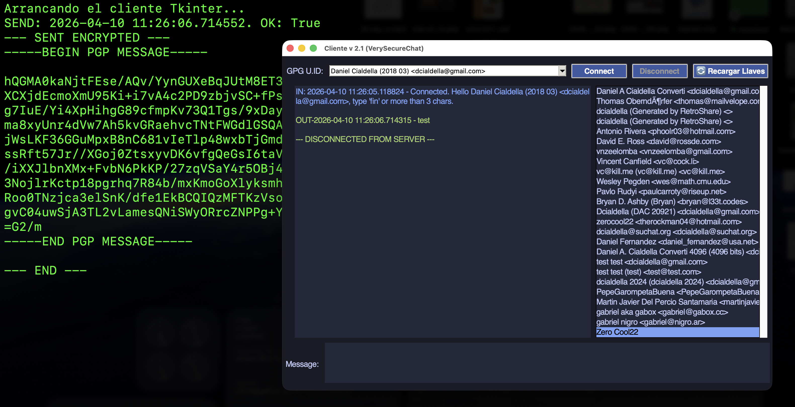

# VerySecureChat v2.7

End-to-end encrypted chat using GPG encryption system.

**BLIND RELAY ARCHITECTURE**: The server acts as a pure relay - it only passes encrypted messages between clients without any ability to decrypt them. The server never sees plaintext content, making it a "blind" intermediary. Since the code is open-source Python, it can be independently audited for security.

## Architecture

```
+----------------------------------------------------------------------+
|                         VERY SECURE CHAT                             |
|                           ARCHITECTURE v2.7                          |
+----------------------------------------------------------------------+

   +-----------+                              +-----------+
   |  CLIENT A |                              |  CLIENT B |
   |  (User)   |                              |  (User)   |
   +------+----+                              +------+----+
          |                                        |
          |    [GPG Encrypt]                       |    [GPG Encrypt]
          |    UID: user_A                         |    UID: user_B
          v                                        v
   +-----------------------------------------------------------+
   |                     SERVER (Relay)                        |
   |                     ----------------                      |
   |  Port: 13031                                           |
   |  Mode: Blind Relay (relays encrypted messages only)    |
   |  Max Message: 5MB (OOM protection)                     |
   |  Heartbeat: 30s                                       |
   +-----------------------------------------------------------+
          |                                        |
          |    [GPG Decrypt]                       |    [GPG Decrypt]
          v                                        v
   +-----------+                              +-----------+
   | Decrypted |                              | Decrypted |
   |  Message  |                              |  Message  |
   +-----------+                              +-----------+


+----------------------------------------------------------------------+
|                      MESSAGE FLOW                                   |
+----------------------------------------------------------------------+

  Client A                    Server                      Client B
     |                          |                          |
     |--[GPG Encrypt(msg)]----->|                          |
     |                          |--[Blind Relay]---------->|
     |                          |                          |--[GPG Decrypt]
     |                          |                          |
     |<--[Blind Relay]----------|<--[GPG Encrypt(msg)]-----|


+----------------------------------------------------------------------+
|                         COMPONENTS                                   |
+----------------------------------------------------------------------+

  CLIENT (client.v.2.0.py)
  +-- GUI: Tkinter
  +-- Encryption: GPG (python-gnupg)
  +-- Port: 13031 (configurable)
  +-- Functions:
      +-- Select recipient (individual or broadcast)
      +-- Encrypt messages with GPG
      +-- Decrypt received messages
      +-- Live key reload

  SERVER (server.v.2.0.py)
  +-- Mode: TCP Socket (blind relay)
  +-- Port: 13031 (default)
  +-- Security: 5MB message limit
  +-- Heartbeat: Ping/Pong every 30s
  +-- GUI: Optional (configurable)


+----------------------------------------------------------------------+
|                      REQUIREMENTS                                     |
+----------------------------------------------------------------------+

  Python 3.11+
  python-gnupg
  GPG installed on system

  Linux/macOS: brew install gnupg
  Windows: https://gpg4win.org/
```

## Screenshots

### Server



### Client


## Installation

```bash
pip install python-gnupg
```

## Configuration

### Server (server_config.json)
```json
{
    "address": "0.0.0.0",
    "port": 13031,
    "gui": false,
    "debug": false
}
```
- **address**: Server IP address (use `0.0.0.0` for all interfaces)
- **port**: TCP port (default: 13031, can be changed)
- **gui**: Enable GUI (true/false)
- **debug**: Enable debug logging (true/false)

### Client (client_config.json)
```json
{
    "server": "127.0.0.1",
    "port": 13031,
    "debug": false,
    "GPGid": "YOUR_KEY_ID"
}
```
- **server**: Server hostname/IP address (can be changed to your server's IP)
- **port**: Server port (default: 13031, must match server config)
- **debug**: Enable debug logging (true/false)
- **GPGid**: Your GPG key ID (REQUIRED - must match your private key)

## Usage

The project includes two shell scripts to run server and client:

```bash
# Start server (uses venv)
./run_server_v2.0.sh

# Start client (uses venv)
./run_client_v2.0.sh
```

Or run directly:

```bash
# Start server
python server.v.2.0.py

# Start client
python client.v.2.0.py
```

## Prerequisites

You must have GPG keys configured:
```bash
gpg --full-generate-key
gpg --list-secret-keys
gpg --list-public-keys
```

## Security Features

- **End-to-End Encryption**: Only the recipient can read messages
- **Blind Relay**: Server only sees encrypted messages, never plaintext - it cannot decrypt anything
- **Auditable Code**: 100% Python open-source - anyone can review the server logic
- **OOM Protection**: 5MB message limit
- **Heartbeat**: Connection monitoring

## Limitations

- No user authentication (server doesn't verify key ownership)
- No rate limiting (vulnerable to flood attacks)
- Public keys must be shared manually between users

## Version

v2.7 - Latest

## Credits

Thanks to IGNIZ for many changes and improvements.